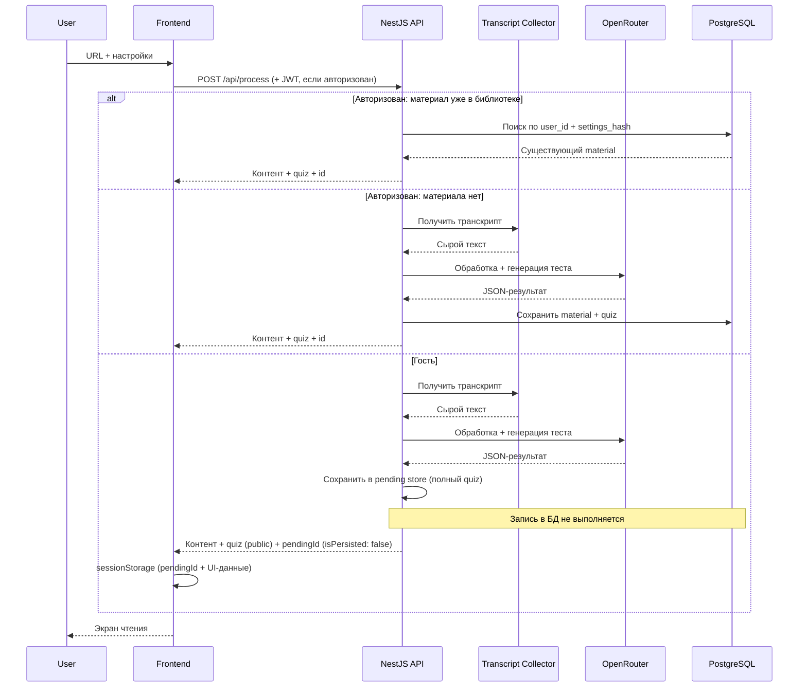

# Design Document: EduTrack AI

> **Источник истины по коду:** [.cursor/rules/project-conventions.mdc](../.cursor/rules/project-conventions.mdc)  
> **UI/UX:** [ui-ux-design.md](./ui-ux-design.md)  
> **Схемы данных:** [schemas-design.md](./schemas-design.md)

## 1. Введение

**Задача:** трансформация пассивного просмотра видеоконтента в активное обучение через текстовую дистилляцию и самопроверку.

**Основная идея:**  
Обучающие видео на YouTube часто содержат много «воды» и мало смысла. **EduTrack AI** экономит время пользователя: превращает видео в структурированные учебные материалы (литературный пересказ или саммари) и генерирует проверочный тест для закрепления.

**Цели проекта:**
- Сократить время на извлечение знаний из видеолекций.
- Дать удобный формат для чтения и повторения материала.
- Закрепить усвоение через автоматически сгенерированные тесты.
- Сохранять прогресс обучения в личной библиотеке.

**Ключевой сценарий:**
1. Пользователь вставляет ссылку на YouTube-лекцию.
2. Выбирает формат контента, язык и параметры теста.
3. Система получает транскрипт, обрабатывает его через AI и возвращает текст с тестом.
4. **Зарегистрированный** пользователь: результат автоматически сохраняется в личную библиотеку.
5. **Гость:** результат доступен только в текущей сессии браузера; для постоянного хранения нужна авторизация.

## 2. User Stories

- **Регистрация и профиль:** как новый пользователь, я хочу создать аккаунт (email/пароль или Google через Firebase), чтобы сохранять конспекты, отслеживать прогресс и видеть статистику усвоения.
- **Гостевой доступ:** как анонимный пользователь, я хочу обработать видео без регистрации, чтобы оценить качество сервиса (без сохранения в БД).
- **Обработка видео:** как пользователь, я хочу вставить URL YouTube-видео и получить его текстовую версию.
- **Настройка контента:** как пользователь, я хочу выбирать формат (пересказ или саммари), объём саммари, язык вывода (RU, EN или язык оригинала) и параметры теста (количество вопросов и вариантов ответа).
- **Интерактивное обучение:** как пользователь, я хочу читать материал на отдельном экране и проходить сгенерированный тест.
- **Личная библиотека:** как зарегистрированный пользователь, я хочу видеть сохранённые материалы со статусом («Прочитано», «Пересдача», «Усвоено»).
- **Дашборд:** как пользователь, я хочу видеть историю активности, категории изученных материалов и дату последнего обращения к ним.

## 3. Функциональные требования

| Модуль | Ответственность |
| :--- | :--- |
| **Transcript Collector** | Получение субтитров/транскрипта через `youtube-transcript-plus` (Innertube API, ручные и автосубтитры, нативно в Node.js). |
| **AI Processing Engine** | Преобразование сырого текста в пересказ или саммари; генерация теста в JSON; выбор категории из фиксированного enum. |
| **Testing System** | Прохождение теста на фронтенде; серверная проверка ответов при сохранении попытки. |
| **Library Management** | CRUD материалов, статусы усвоения, история попыток (только для авторизованных пользователей). |
| **Auth** | Firebase Authentication (Google + email/пароль), выдача JWT, Guard на защищённых маршрутах, logout, привязка гостевой сессии. |
| **User-scoped dedup** | Для авторизованных: повторный запрос с теми же `video_id` + настройками возвращает существующий материал из библиотеки без вызова AI. |

Детальные схемы запросов, ответов и таблиц БД — в [schemas-design.md](./schemas-design.md).

## 4. Архитектура

**Структура репозитория:**

```
backend/
└── src/
    ├── common/              # constants, enums, dto, utils
    └── features/
        ├── database/        # TypeORM: config, module, регистрация entity
        ├── user/            # entity + CRUD (dev)
        ├── auth/            # Firebase session, JWT, guards
        ├── material/        # entity + service (CRUD, dedup lookup)
        ├── quiz/            # entity + types + service (create, best_score)
        ├── quiz-attempt/    # entity + types + service (attempt persistence)
        ├── pending/         # in-memory guest store (TTL 24 ч)
        ├── library/         # /api/library/* — оркестрация material, quiz, pending
        ├── transcript/      # YouTube transcript (service + dev POST /api/transcript/fetch)
        ├── llm/             # OpenRouter AI processing (service, без HTTP)
        ├── refresh-token/   # entity
        ├── health/
        └── process/         # POST /api/process (transcript + llm + persist/pending)
frontend/                    # React + Vite SPA (React Router)
└── src/
    ├── common/              # enums, constants, types, components, utils, stores
    └── features/
        ├── main-page/       # главная страница (main.tsx, main.service.ts, …)
        ├── axios/           # shared axios client (baseURL /api)
        ├── reader/          # types, utils, service (GET /api/library/:id)
        ├── quiz/            # types, utils, service (POST quiz attempts)
        ├── profile/         # types, utils, service (library list/status/delete)
        ├── library/         # claim-pending service
        └── auth/            # Firebase Auth, JWT-сессия, модальное окно
docs/                        # Продуктовая и техническая документация
```

**`AppModule` (подключено сейчас):** `HealthModule`, `DatabaseModule`, `AuthModule`, `LibraryModule`, `ProcessModule`, `TranscriptModule`.  
OpenAPI/Swagger UI: `GET /docs`.

**Организация кода** — по [project-conventions.mdc](../.cursor/rules/project-conventions.mdc): feature-based модули в `src/features/`, общие утилиты в `src/common/` (отдельно в `backend/` и `frontend/`). Фича `database` отвечает только за подключение TypeORM; доменные сущности (`user`, `material`, `quiz`, …) — отдельные фичи на одном уровне.

**Основные фичи (backend):**

| Feature | Статус | Назначение |
| :--- | :--- | :--- |
| `database` | ✓ | TypeORM-конфигурация, `synchronize`, регистрация entity. |
| `user` | ✓ | Entity `users`, CRUD-эндпоинты `/api/users/*` (dev). |
| `auth` | ✓ | Firebase Admin + JWT; `/api/auth/session`, `/refresh`, `/logout`; `JwtAuthGuard`, `OptionalJwtAuthGuard`. |
| `material` | ✓ | Entity `materials`; `MaterialService` — CRUD, dedup lookup, `last_viewed_at`. |
| `quiz` | ✓ | Entity `quizzes`, типы JSONB-вопросов; `QuizService` — создание quiz, обновление `best_score`; `quiz.utils` — серверная проверка ответов. |
| `quiz-attempt` | ✓ | Entity `quiz_attempts`, типы ответов; `QuizAttemptService` — сохранение попыток. |
| `pending` | ✓ | In-memory pending store (`Map`, TTL 24 ч); запись — из `process`, чтение/claim — `library`. |
| `library` | ✓ | API `/api/library/*`; `LibraryService` оркестрирует `material`, `quiz`, `quiz-attempt`, `pending`. |
| `transcript` | ✓ | `TranscriptService` + `youtube-transcript-plus`; dev-эндпоинт `POST /api/transcript/fetch`. |
| `llm` | ✓ | `LlmService` + `OpenRouterClient`; structured JSON output; chunking > 45 мин; без публичного HTTP-контроллера. |
| `process` | ✓ | `POST /api/process` — оркестрация transcript → llm → persist/pending. |
| `refresh-token` | ✓ | Entity `refresh_tokens`. |
| `health` | ✓ | `GET /` — health-check. |

**Основные фичи (frontend):**

| Feature | Статус | Назначение |
| :--- | :--- | :--- |
| `axios` | ✓ client | Shared HTTP client + JWT refresh interceptor. |
| `main-page` | ✓ UI + API | Ввод URL, настройки обработки, `POST /api/process`. |
| `reader` | ✓ UI + service | Режим чтения; `reader.service` — `GET /api/library/:id`; удаление через `profile.service`. |
| `quiz` | ✓ UI + service | Прохождение теста; `quiz.service` — `POST /api/library/:id/quiz/attempts` для сохранённых материалов. |
| `profile` | ✓ UI + service | Дашборд и библиотека; `profile.service` — list/status/delete; «Продолжить» → `reader.service`. |
| `library` | ✓ service | `claim-pending` после авторизации гостя. |
| `auth` | ✓ UI + API | Firebase Auth, JWT-сессия, модальное окно для гостей. |

**Поток обработки видео:**



**UI/UX-решения** (экраны, цвета, компоненты) — в [ui-ux-design.md](./ui-ux-design.md).

## 5. API Overview

| Метод | Endpoint | Auth | Назначение |
| :--- | :--- | :--- | :--- |
| `GET` | `/` | — | Health-check (`{ "status": "ok" }`). |
| `GET` | `/docs` | — | Swagger UI (OpenAPI). |
| `POST` | `/api/auth/session` | — | Обмен Firebase ID Token на JWT-пару. |
| `POST` | `/api/auth/refresh` | — | Обновление access token по refresh token. |
| `POST` | `/api/auth/logout` | — | Отзыв refresh token. |
| `POST` | `/api/process` | Optional | Обработка видео; для авторизованных — автосохранение в библиотеку. |
| `POST` | `/api/transcript/fetch` | — | *(dev)* Проверка извлечения субтитров YouTube. |
| `POST` | `/api/library/claim-pending` | JWT | Сохранение гостевого материала по `pendingId` после входа. |
| `GET` | `/api/library` | JWT | Список материалов текущего пользователя. |
| `GET` | `/api/library/:id` | JWT | Полный текст, тест и история попыток. |
| `PATCH` | `/api/library/:id/status` | JWT | Обновление статуса материала. |
| `DELETE` | `/api/library/:id` | JWT | Удаление материала из библиотеки. |
| `POST` | `/api/library/:id/quiz/attempts` | JWT | Сохранение результата прохождения теста. |
| `GET` | `/api/users` | — | Список пользователей (инфраструктурный CRUD, dev). |
| `GET` | `/api/users/:id` | — | Пользователь по id. |
| `POST` | `/api/users` | — | Создание пользователя. |
| `PATCH` | `/api/users/:id` | — | Обновление пользователя. |
| `DELETE` | `/api/users/:id` | — | Удаление пользователя. |

JSON-схемы запросов и ответов — в [schemas-design.md](./schemas-design.md).

## 6. Ключевые технические решения

Решения, специфичные для продукта (стек и конвенции кода — в [project-conventions.mdc](../.cursor/rules/project-conventions.mdc)):

| Область | Решение | Обоснование |
| :--- | :--- | :--- |
| **AI-провайдер** | OpenRouter | Единый API к множеству моделей; маршрутизация с `require_parameters: true` для strict JSON Schema structured output. Переменные — `OPEN_ROUTER_API_KEY`, `OPEN_ROUTER_MODEL` (см. `backend/.env.example`). |
| **Транскрипт** | `youtube-transcript-plus` | Innertube API; поддержка ручных и автосубтитров (`listLanguages` + `isAutoGenerated`); нативная интеграция в NestJS без Python/subprocess; retry при transient-ошибках. |
| **Длинные видео** | Chunking + MapReduce при длительности > 45 мин | Обход лимитов контекстного окна AI. |
| **Персистентность** | Только для авторизованных пользователей | Материалы хранятся в `materials` в рамках аккаунта; гости работают без записи в БД. |
| **Дедупликация** | `settings_hash` в `materials` (per user) | Повторная обработка того же видео с теми же настройками возвращает существующий материал без вызова AI. |
| **Аутентификация** | Firebase Auth + JWT (access + refresh) | Firebase управляет Google/email-потоками; NestJS `JwtAuthGuard` защищает API. |
| **Гостевая сессия** | `pendingId` + UI-данные в `sessionStorage` | Бэкенд хранит полный результат во in-memory pending store (TTL 24 ч); после входа — `claim-pending` по `pendingId`. |
| **Состояние UI** | Zustand | Лёгкое глобальное состояние для шагов обработки и reader/quiz. Доменные поля типизируются через `enum` из `common/enums/` (единое соглашение с бэкендом). |
| **Маршрутизация** | React Router | Клиентская навигация между экранами (`/`, reader, quiz, profile — по мере реализации). |
| **Категории** | Enum `MaterialCategory` + structured output AI | Единообразная классификация материалов для дашборда и фильтрации. |
| **Валидация API** | `class-validator` + `class-transformer` | Согласовано с конвенциями бэкенда. |
| **ORM** | TypeORM (`synchronize: true` в dev) | Entity — в отдельных фичах (`user/`, `material/`, `quiz/`, …); инфраструктура — в `features/database/`. DTO — `common/dto/` ([диаграмма](./mermaid-dto-class-diagram.md)), enums — `common/enums/`. Схема API — в [schemas-design.md](./schemas-design.md). |
| **Валидация форм** | Yup | Согласовано с конвенциями фронтенда. |

## 7. Технические нюансы и вызовы

- **Лимиты контекстного окна:** длинные лекции обрабатываются по частям с последующей агрегацией.
- **Качество транскрипта:** автоматические субтитры YouTube содержат ошибки; промпт AI включает инструкцию по исправлению опечаток и пунктуации.
- **Безопасность:** rate limiting на `/api/process` (по IP для гостей, по `user_id` для авторизованных), чтобы не исчерпать бюджет AI-токенов.
- **Отсутствие субтитров:** возвращать понятную ошибку пользователю; распознавание аудио (Whisper) — вне scope MVP.
- **Проверка тестов:** ответы проверяются на сервере при `POST /api/library/:id/quiz/attempts`; клиент не является источником истины для `score`. `correctAnswerIndex` не отдаётся в API-ответах до сдачи попытки.

## 8. Потенциальные сложности

| Сложность | Решение |
| :--- | :--- |
| Видео без субтитров | Ошибка с рекомендацией выбрать другое видео. |
| Очень длинные лекции (> 45 мин) | Chunking с прогрессом на UI (см. [ui-ux-design.md](./ui-ux-design.md)). |
| Повторная обработка одного URL (авторизованный) | Дедуп по `user_id` + `settings_hash` в `materials`. |
| Гость теряет материал | Модальное окно авторизации + `POST /api/library/claim-pending` с `pendingId` из `sessionStorage`. |
| Гость закрыл вкладку | Материал недоступен — в БД не сохранялся; предложить авторизацию до закрытия. |
