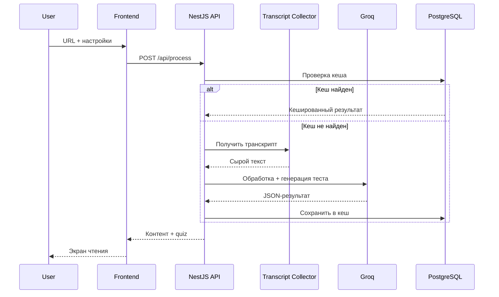

# Design Document: EduTrack AI

> **Источник истины по коду:** [.cursor/rules/project-conventions.mdc](../.cursor/rules/project-conventions.mdc)  
> **UI/UX:** [ui-ux-design.md](./ui-ux-design.md)  
> **Схемы данных:** [schemas-design.md](./schemas-design.md)

## 1. Введение

**Задача:** трансформация пассивного просмотра видеоконтента в активное обучение через текстовую дистилляцию и самопроверку.

**Основная идея:**  
Обучающие видео на YouTube часто содержат много «воды» и мало смысла. **EduTrack AI** экономит время пользователя: превращает видео в структурированные учебные материалы (литературный пересказ или саммари) и генерирует проверочный тест для закрепления.

**Цели проекта:**
- Сократить время на извлечение знаний из видеолекций.
- Дать удобный формат для чтения и повторения материала.
- Закрепить усвоение через автоматически сгенерированные тесты.
- Сохранять прогресс обучения в личной библиотеке.

**Ключевой сценарий:**
1. Пользователь вставляет ссылку на YouTube-лекцию.
2. Выбирает формат контента, язык и параметры теста.
3. Система получает транскрипт, обрабатывает его через AI и возвращает текст с тестом.
4. Пользователь читает материал, проходит тест и сохраняет результат в «Базу знаний».

## 2. User Stories

- **Регистрация и профиль:** как новый пользователь, я хочу создать аккаунт, чтобы сохранять конспекты, отслеживать прогресс и видеть статистику усвоения.
- **Гостевой доступ:** как анонимный пользователь, я хочу обработать видео без регистрации, чтобы оценить качество сервиса.
- **Обработка видео:** как пользователь, я хочу вставить URL YouTube-видео и получить его текстовую версию.
- **Настройка контента:** как пользователь, я хочу выбирать формат (пересказ или саммари), объём саммари, язык вывода (RU, EN или язык оригинала) и параметры теста (количество вопросов и вариантов ответа).
- **Интерактивное обучение:** как пользователь, я хочу читать материал на отдельном экране и проходить сгенерированный тест.
- **Личная библиотека:** как зарегистрированный пользователь, я хочу сохранять материалы со статусом («Прочитано», «Пересдача», «Усвоено»).
- **Дашборд:** как пользователь, я хочу видеть историю активности, категории изученных материалов и дату последнего обращения к ним.

## 3. Функциональные требования

| Модуль | Ответственность |
| :--- | :--- |
| **Transcript Collector** | Получение субтитров/транскрипта через `youtube-transcript-api`. |
| **AI Processing Engine** | Преобразование сырого текста в пересказ или саммари; генерация теста в JSON. |
| **Testing System** | Прохождение теста на фронтенде с мгновенной проверкой и подсчётом баллов. |
| **Library Management** | CRUD материалов, статусы усвоения, история попыток. |
| **Auth** | Регистрация, вход, привязка гостевой сессии к аккаунту. |
| **Caching** | Кеширование результата обработки по паре `video_id` + настройки, чтобы не тратить AI-токены повторно. |

Детальные схемы запросов, ответов и таблиц БД — в [schemas-design.md](./schemas-design.md).

## 4. Архитектура

**Организация кода** — по [project-conventions.mdc](../.cursor/rules/project-conventions.mdc): feature-based модули в `src/features/`, общие утилиты в `src/common/`.

**Основные фичи:**

| Feature | Назначение |
| :--- | :--- |
| `main-page` | Ввод URL, настройки обработки, запуск pipeline. |
| `reader` | Режим чтения сгенерированного контента. |
| `quiz` | Прохождение теста и отображение результата. |
| `profile` | Дашборд, библиотека материалов, статистика. |
| `auth` | Регистрация, вход, модальное окно для гостей. |

**Поток обработки видео:**

**UI/UX-решения** (экраны, цвета, компоненты) — в [ui-ux-design.md](./ui-ux-design.md).

## 5. API Overview

| Метод | Endpoint | Назначение |
| :--- | :--- | :--- |
| `POST` | `/api/auth/register` | Регистрация пользователя. |
| `POST` | `/api/auth/login` | Вход в аккаунт. |
| `POST` | `/api/process` | Обработка видео по URL и настройкам. |
| `GET` | `/api/library` | Список материалов текущего пользователя. |
| `POST` | `/api/library` | Сохранение материала (в т.ч. после регистрации гостя). |
| `GET` | `/api/library/:id` | Полный текст, тест и история попыток. |
| `PATCH` | `/api/library/:id/status` | Обновление статуса материала. |
| `DELETE` | `/api/library/:id` | Удаление материала из библиотеки. |

JSON-схемы запросов и ответов — в [schemas-design.md](./schemas-design.md).

## 6. Ключевые технические решения

Решения, специфичные для продукта (стек и конвенции кода — в [project-conventions.mdc](../.cursor/rules/project-conventions.mdc)):

| Область | Решение | Обоснование |
| :--- | :--- | :--- |
| **AI-провайдер** | Groq | Оптимальное соотношение цены и качества для текстовой обработки. |
| **Транскрипт** | `youtube-transcript-api` | Лёгкая интеграция без тяжёлого Google API. |
| **Длинные видео** | Chunking + MapReduce при длительности > 45 мин | Обход лимитов контекстного окна AI. |
| **Кеширование** | Таблица `processing_cache` в PostgreSQL | Повторные запросы с теми же параметрами без вызова AI. |
| **Гостевая сессия** | `sessionStorage` на фронтенде | Временное хранение последнего результата до регистрации. |
| **Состояние UI** | Zustand | Лёгкое глобальное состояние для шагов обработки и reader/quiz. |
| **Валидация API** | `class-validator` + `class-transformer` | Согласовано с конвенциями бэкенда. |
| **Валидация форм** | Yup | Согласовано с конвенциями фронтенда. |

## 7. Технические нюансы и вызовы

- **Лимиты контекстного окна:** длинные лекции обрабатываются по частям с последующей агрегацией.
- **Качество транскрипта:** автоматические субтитры YouTube содержат ошибки; промпт AI включает инструкцию по исправлению опечаток и пунктуации.
- **Безопасность:** rate limiting на `/api/process`, чтобы один пользователь не исчерпал бюджет AI-токенов.
- **Отсутствие субтитров:** возвращать понятную ошибку пользователю; распознавание аудио (Whisper) — вне scope MVP.

## 8. Потенциальные сложности

| Сложность | Решение |
| :--- | :--- |
| Видео без субтитров | Ошибка с рекомендацией выбрать другое видео. |
| Очень длинные лекции (> 45 мин) | Chunking с прогрессом на UI (см. [ui-ux-design.md](./ui-ux-design.md)). |
| Повторная обработка одного URL | Кеш по `video_id` + hash настроек. |
| Гость теряет материал | Модальное окно регистрации + автосохранение из `sessionStorage` после входа. |
