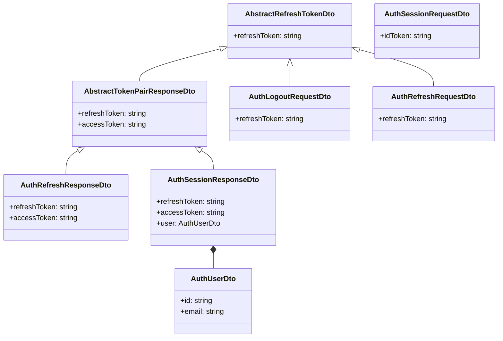
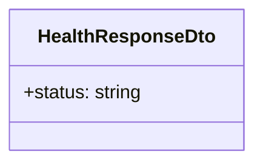
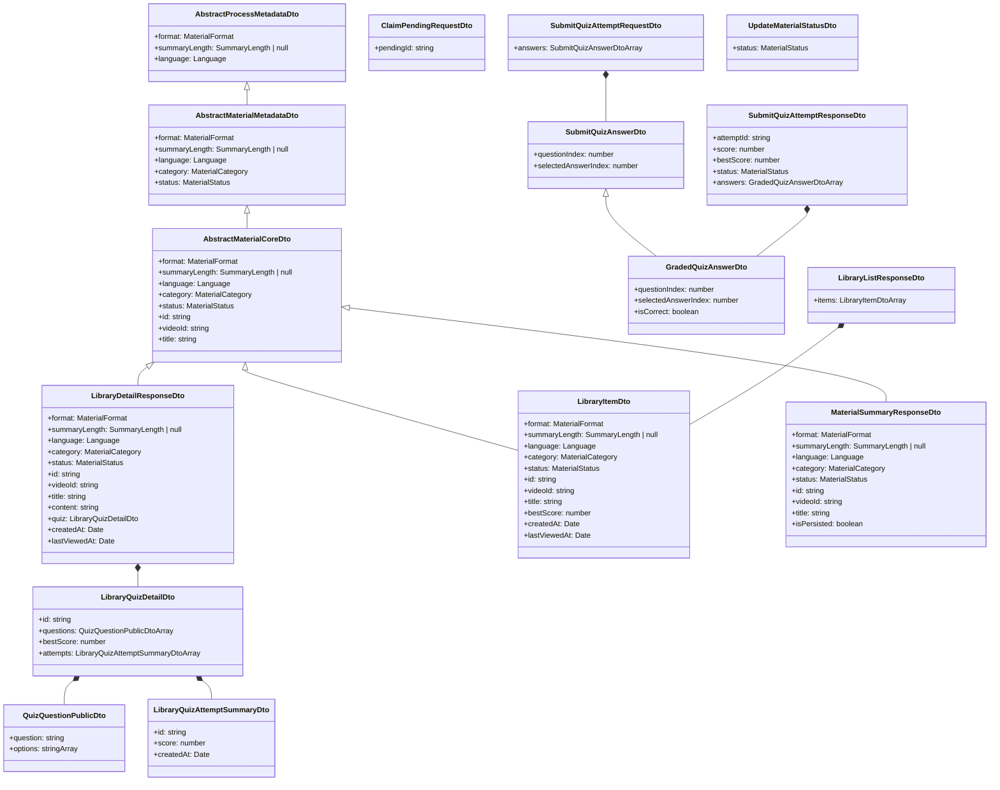
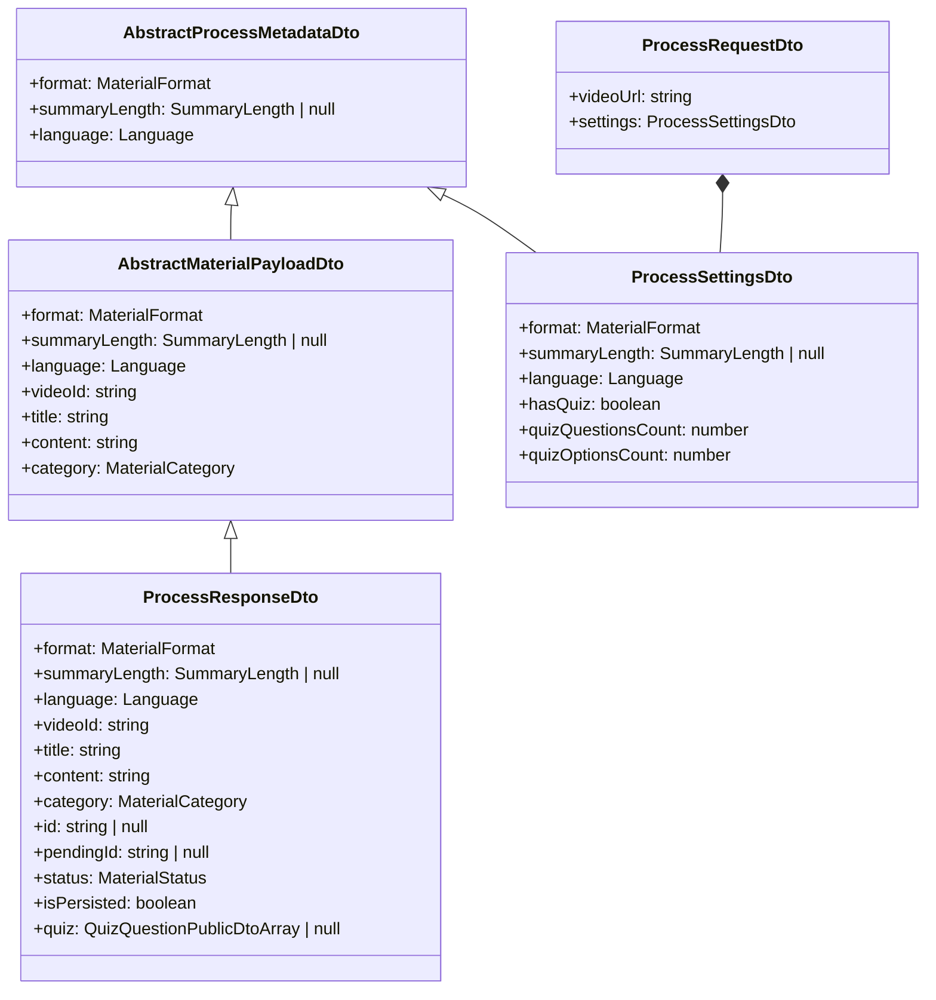
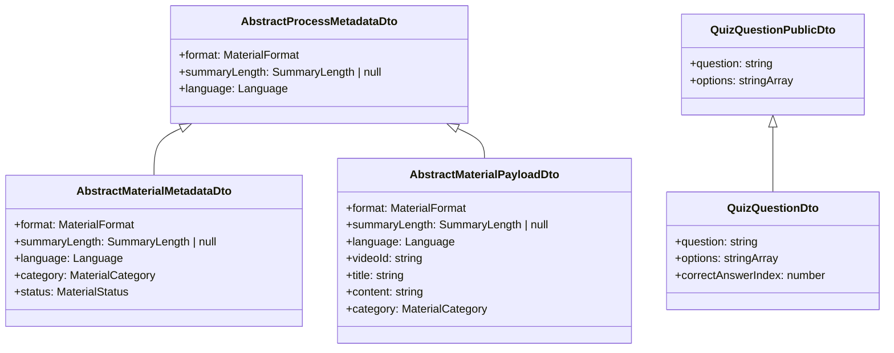
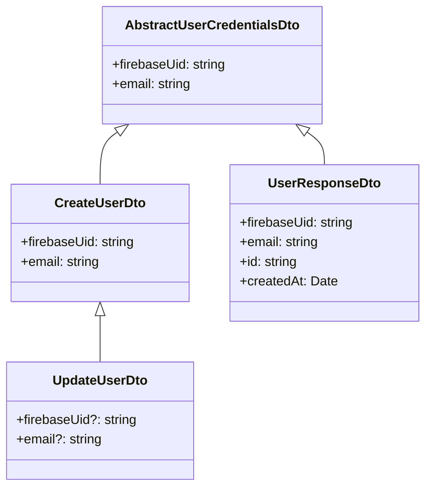

# DTO Mermaid Class Diagram

> **Auto-generated.** Do not edit manually.
> **Sources:** `backend/src/common/dto`, `backend/src/features/health/health-response.dto.ts`
> **Generated at:** 2026-06-18T10:36:54.067Z
> **Manual reference:** [schemas-design.md](./schemas-design.md) §4 (API JSON Schemas)

Наследование (`<|--`), композиция (`*--`). Классы с префиксом `Abstract` — внутренние предки.

---

## Обзор

```mermaid
classDiagram
    direction TB

    class AbstractMaterialCoreDto {
        +format: MaterialFormat
        +summaryLength: SummaryLength | null
        +language: Language
        +category: MaterialCategory
        +status: MaterialStatus
        +id: string
        +videoId: string
        +title: string
    }

    class AbstractMaterialMetadataDto {
        +format: MaterialFormat
        +summaryLength: SummaryLength | null
        +language: Language
        +category: MaterialCategory
        +status: MaterialStatus
    }

    class AbstractMaterialPayloadDto {
        +format: MaterialFormat
        +summaryLength: SummaryLength | null
        +language: Language
        +videoId: string
        +title: string
        +content: string
        +category: MaterialCategory
    }

    class AbstractProcessMetadataDto {
        +format: MaterialFormat
        +summaryLength: SummaryLength | null
        +language: Language
    }

    class AbstractRefreshTokenDto {
        +refreshToken: string
    }

    class AbstractTokenPairResponseDto {
        +refreshToken: string
        +accessToken: string
    }

    class AbstractUserCredentialsDto {
        +firebaseUid: string
        +email: string
    }

    class AuthLogoutRequestDto {
        +refreshToken: string
    }

    class AuthRefreshRequestDto {
        +refreshToken: string
    }

    class AuthRefreshResponseDto {
        +refreshToken: string
        +accessToken: string
    }

    class AuthSessionRequestDto {
        +idToken: string
    }

    class AuthSessionResponseDto {
        +refreshToken: string
        +accessToken: string
        +user: AuthUserDto
    }

    class AuthUserDto {
        +id: string
        +email: string
    }

    class ClaimPendingRequestDto {
        +pendingId: string
    }

    class CreateUserDto {
        +firebaseUid: string
        +email: string
    }

    class GradedQuizAnswerDto {
        +questionIndex: number
        +selectedAnswerIndex: number
        +isCorrect: boolean
    }

    class HealthResponseDto {
        +status: string
    }

    class LibraryDetailResponseDto {
        +format: MaterialFormat
        +summaryLength: SummaryLength | null
        +language: Language
        +category: MaterialCategory
        +status: MaterialStatus
        +id: string
        +videoId: string
        +title: string
        +content: string
        +quiz: LibraryQuizDetailDto
        +createdAt: Date
        +lastViewedAt: Date
    }

    class LibraryItemDto {
        +format: MaterialFormat
        +summaryLength: SummaryLength | null
        +language: Language
        +category: MaterialCategory
        +status: MaterialStatus
        +id: string
        +videoId: string
        +title: string
        +bestScore: number
        +createdAt: Date
        +lastViewedAt: Date
    }

    class LibraryListResponseDto {
        +items: LibraryItemDtoArray
    }

    class LibraryQuizAttemptSummaryDto {
        +id: string
        +score: number
        +createdAt: Date
    }

    class LibraryQuizDetailDto {
        +id: string
        +questions: QuizQuestionPublicDtoArray
        +bestScore: number
        +attempts: LibraryQuizAttemptSummaryDtoArray
    }

    class MaterialSummaryResponseDto {
        +format: MaterialFormat
        +summaryLength: SummaryLength | null
        +language: Language
        +category: MaterialCategory
        +status: MaterialStatus
        +id: string
        +videoId: string
        +title: string
        +isPersisted: boolean
    }

    class ProcessRequestDto {
        +videoUrl: string
        +settings: ProcessSettingsDto
    }

    class ProcessResponseDto {
        +format: MaterialFormat
        +summaryLength: SummaryLength | null
        +language: Language
        +videoId: string
        +title: string
        +content: string
        +category: MaterialCategory
        +id: string | null
        +pendingId: string | null
        +status: MaterialStatus
        +isPersisted: boolean
        +quiz: QuizQuestionPublicDtoArray | null
    }

    class ProcessSettingsDto {
        +format: MaterialFormat
        +summaryLength: SummaryLength | null
        +language: Language
        +hasQuiz: boolean
        +quizQuestionsCount: number
        +quizOptionsCount: number
    }

    class QuizQuestionDto {
        +question: string
        +options: stringArray
        +correctAnswerIndex: number
    }

    class QuizQuestionPublicDto {
        +question: string
        +options: stringArray
    }

    class SubmitQuizAnswerDto {
        +questionIndex: number
        +selectedAnswerIndex: number
    }

    class SubmitQuizAttemptRequestDto {
        +answers: SubmitQuizAnswerDtoArray
    }

    class SubmitQuizAttemptResponseDto {
        +attemptId: string
        +score: number
        +bestScore: number
        +status: MaterialStatus
        +answers: GradedQuizAnswerDtoArray
    }

    class UpdateMaterialStatusDto {
        +status: MaterialStatus
    }

    class UpdateUserDto {
        +firebaseUid?: string
        +email?: string
    }

    class UserResponseDto {
        +firebaseUid: string
        +email: string
        +id: string
        +createdAt: Date
    }

    AbstractMaterialMetadataDto <|-- AbstractMaterialCoreDto
    AbstractProcessMetadataDto <|-- AbstractMaterialMetadataDto
    AbstractProcessMetadataDto <|-- AbstractMaterialPayloadDto
    AbstractRefreshTokenDto <|-- AbstractTokenPairResponseDto
    AbstractRefreshTokenDto <|-- AuthLogoutRequestDto
    AbstractRefreshTokenDto <|-- AuthRefreshRequestDto
    AbstractTokenPairResponseDto <|-- AuthRefreshResponseDto
    AbstractTokenPairResponseDto <|-- AuthSessionResponseDto
    AbstractUserCredentialsDto <|-- CreateUserDto
    SubmitQuizAnswerDto <|-- GradedQuizAnswerDto
    AbstractMaterialCoreDto <|-- LibraryDetailResponseDto
    AbstractMaterialCoreDto <|-- LibraryItemDto
    AbstractMaterialCoreDto <|-- MaterialSummaryResponseDto
    AbstractMaterialPayloadDto <|-- ProcessResponseDto
    AbstractProcessMetadataDto <|-- ProcessSettingsDto
    QuizQuestionPublicDto <|-- QuizQuestionDto
    CreateUserDto <|-- UpdateUserDto
    AbstractUserCredentialsDto <|-- UserResponseDto
    AuthSessionResponseDto *-- AuthUserDto
    LibraryDetailResponseDto *-- LibraryQuizDetailDto
    LibraryListResponseDto *-- LibraryItemDto
    LibraryQuizDetailDto *-- QuizQuestionPublicDto
    LibraryQuizDetailDto *-- LibraryQuizAttemptSummaryDto
    ProcessRequestDto *-- ProcessSettingsDto
    SubmitQuizAttemptRequestDto *-- SubmitQuizAnswerDto
    SubmitQuizAttemptResponseDto *-- GradedQuizAnswerDto
```

## Auth

## Health

## Library

## Process

## Shared

## User

