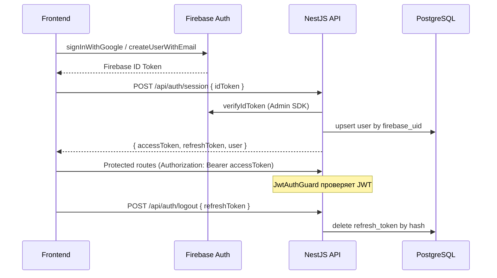

# Design Schemas: EduTrack AI

> **Источник истины по коду:** [.cursor/rules/project-conventions.mdc](../.cursor/rules/project-conventions.mdc)  
> **Продукт и архитектура:** [main-design.md](./main-design.md)  
> **UI/UX:** [ui-ux-design.md](./ui-ux-design.md)

Единый справочник структур данных: БД, API, AI-ответы, компоненты и состояние UI.

## 1. Enums

| Enum | Значения | Использование |
| :--- | :--- | :--- |
| `MaterialFormat` | `narrative`, `summary` | Формат обработанного текста |
| `SummaryLength` | `short`, `medium`, `long` | Объём саммари (только при `format: summary`) |
| `Language` | `ru`, `en`, `original` | Язык вывода контента |
| `MaterialCategory` | `programming`, `mathematics`, `science`, `humanities`, `languages`, `business`, `arts`, `health`, `technology`, `other` | Категория материала; AI выбирает одно значение через structured output |
| `MaterialStatus` | `read`, `retake`, `mastered` | Статус усвоения материала |
| `ProcessStep` | `idle`, `transcribing`, `ai_processing`, `completed` | Шаг pipeline на фронтенде |

**Соглашения по именованию:**
- PostgreSQL: `snake_case`
- JSON API и TypeScript: `camelCase`

**UI-лейблы для `MaterialCategory` (русский):**

| Значение | Подпись |
| :--- | :--- |
| `programming` | Программирование |
| `mathematics` | Математика |
| `science` | Наука |
| `humanities` | Гуманитарные науки |
| `languages` | Языки |
| `business` | Бизнес |
| `arts` | Искусство |
| `health` | Здоровье |
| `technology` | Технологии |
| `other` | Другое |

---

## 2. Database Schema (PostgreSQL)

Идентификаторы — `uuid`, генерируются через `uuid_generate_v4()`.

> **ORM:** TypeORM entity-классы — в отдельных фичах `backend/src/features/` (`user/`, `material/`, `quiz/`, `quiz-attempt/`, `refresh-token/`). Подключение и `synchronize` — в `features/database/`. DTO — в `backend/src/common/dto/` (по домену, напр. `dto/user/`), enums — в `backend/src/common/enums/`. Диаграмма DTO-классов — [mermaid-dto-class-diagram.md](./mermaid-dto-class-diagram.md). В dev-режиме `synchronize: true` — схема автоматически приводится к entity-описанию. Переменные окружения — в `backend/.env.example` (БД, JWT, Firebase, OpenRouter).

> **Принцип персистентности:** записи в БД создаются только для авторизованных пользователей. Гостевые запросы не оставляют следов в PostgreSQL.

### Table: `users`

| Column | Type | Constraints |
| :--- | :--- | :--- |
| `id` | `uuid` | `PRIMARY KEY, DEFAULT uuid_generate_v4()` |
| `firebase_uid` | `varchar(128)` | `UNIQUE, NOT NULL` |
| `email` | `varchar(255)` | `UNIQUE, NOT NULL` |
| `created_at` | `timestamptz` | `DEFAULT now()` |

Учётные данные (пароль, Google OAuth) управляются Firebase Authentication. Бэкенд хранит только связку `firebase_uid` ↔ локальный `id`.

### Table: `refresh_tokens`

| Column | Type | Constraints |
| :--- | :--- | :--- |
| `id` | `uuid` | `PRIMARY KEY, DEFAULT uuid_generate_v4()` |
| `user_id` | `uuid` | `FOREIGN KEY REFERENCES users(id) ON DELETE CASCADE, NOT NULL` |
| `token_hash` | `varchar(64)` | `UNIQUE, NOT NULL` |
| `expires_at` | `timestamptz` | `NOT NULL` |
| `created_at` | `timestamptz` | `DEFAULT now()` |

Используется для refresh-потока и отзыва при logout.

### Table: `materials`

| Column | Type | Constraints |
| :--- | :--- | :--- |
| `id` | `uuid` | `PRIMARY KEY, DEFAULT uuid_generate_v4()` |
| `user_id` | `uuid` | `FOREIGN KEY REFERENCES users(id) ON DELETE CASCADE, NOT NULL` |
| `video_id` | `varchar(50)` | `NOT NULL` |
| `settings_hash` | `varchar(64)` | `NOT NULL` |
| `title` | `varchar(255)` | `NOT NULL` |
| `content` | `text` | `NOT NULL` |
| `category` | `material_category` | `NOT NULL` |
| `format` | `material_format` | `NOT NULL` |
| `summary_length` | `summary_length` | `NULLABLE` (только для `summary`) |
| `language` | `varchar(10)` | `NOT NULL` |
| `status` | `material_status` | `NOT NULL, DEFAULT 'read'` |
| `created_at` | `timestamptz` | `DEFAULT now()` |
| `last_viewed_at` | `timestamptz` | `DEFAULT now()` |

**Индекс:** `UNIQUE (user_id, settings_hash)`.

`settings_hash` — SHA-256 от канонического JSON, включающего `videoId` и настройки обработки (см. §8). Такой подход устраняет проблему `NULL` в `summary_length` и однозначно идентифицирует материал в рамках аккаунта.

### Table: `quizzes`

| Column | Type | Constraints |
| :--- | :--- | :--- |
| `id` | `uuid` | `PRIMARY KEY, DEFAULT uuid_generate_v4()` |
| `material_id` | `uuid` | `FOREIGN KEY REFERENCES materials(id) ON DELETE CASCADE, UNIQUE` |
| `questions` | `jsonb` | `NOT NULL` |
| `best_score` | `integer` | `DEFAULT 0, CHECK (best_score >= 0 AND best_score <= 100)` |

**Структура `questions` (JSONB):**

```json
[
  {
    "question": "string",
    "options": ["string"],
    "correctAnswerIndex": 0
  }
]
```

### Table: `quiz_attempts`

| Column | Type | Constraints |
| :--- | :--- | :--- |
| `id` | `uuid` | `PRIMARY KEY, DEFAULT uuid_generate_v4()` |
| `quiz_id` | `uuid` | `FOREIGN KEY REFERENCES quizzes(id) ON DELETE CASCADE` |
| `score` | `integer` | `NOT NULL, CHECK (score >= 0 AND score <= 100)` |
| `answers` | `jsonb` | `NOT NULL` |
| `created_at` | `timestamptz` | `DEFAULT now()` |

**Структура `answers` (JSONB):**

```json
[
  {
    "questionIndex": 0,
    "selectedAnswerIndex": 1,
    "isCorrect": false
  }
]
```

---

## 3. Auth Flow

### Общая схема



| Компонент | Ответственность |
| :--- | :--- |
| **Firebase Auth (frontend)** | Google Sign-In, регистрация/вход по email+паролю, получение ID Token. |
| **Firebase Admin SDK (backend)** | Верификация ID Token при создании сессии. |
| **JWT access token** | Короткоживущий (15 мин), payload: `{ sub: userId, email }`. |
| **Refresh token** | Долгоживущий (7 дней), opaque string, хранится hashed в `refresh_tokens`. |
| **`JwtAuthGuard`** | NestJS Guard на всех `/api/library/*` маршрутах. |
| **`OptionalJwtAuthGuard`** | На `POST /api/process` — если JWT передан, выполняется автосохранение. |

### Привязка гостевой сессии

1. Гость обрабатывает видео → бэкенд сохраняет **полный** результат (включая quiz с `correctAnswerIndex`) во **in-memory pending store** (`Map`, TTL 24 ч) и возвращает клиенту только публичные поля + `pendingId`.
2. Фронтенд кладёт `pendingId` и данные для UI в Zustand + `sessionStorage` (`edutrack:pendingMaterial`). `correctAnswerIndex` клиенту **не передаётся**.
3. Гость нажимает «Сохранить» → модальное окно авторизации.
4. После успешного `POST /api/auth/session` → фронтенд вызывает `POST /api/library/claim-pending` с `{ "pendingId": "..." }`.
5. Бэкенд загружает данные из pending store и создаёт `material` + `quiz` (или возвращает существующий при совпадении `settings_hash`).
6. `sessionStorage` очищается; запись в pending store удаляется; материал появляется в библиотеке.

---

## 4. API JSON Schemas

### GET `/`

**Auth:** не требуется.

**Response (200):**

```json
{
  "status": "ok"
}
```

### POST `/api/auth/session`

**Request:**

```json
{
  "idToken": "firebase-id-token-string"
}
```

**Response (200):**

```json
{
  "accessToken": "jwt-string",
  "refreshToken": "opaque-refresh-token",
  "user": {
    "id": "uuid",
    "email": "user@example.com"
  }
}
```

### POST `/api/auth/refresh`

**Request:**

```json
{
  "refreshToken": "opaque-refresh-token"
}
```

**Response (200):**

```json
{
  "accessToken": "jwt-string",
  "refreshToken": "opaque-refresh-token"
}
```

При refresh старый refresh token отзывается, выдаётся новая пара (rotation).

### POST `/api/auth/logout`

**Request:**

```json
{
  "refreshToken": "opaque-refresh-token"
}
```

**Response (204):** без тела. Refresh token удаляется из `refresh_tokens`; access token истекает естественно (stateless).

**Защищённые маршруты:** заголовок `Authorization: Bearer <accessToken>`.

### POST `/api/transcript/fetch` *(dev)*

**Auth:** не требуется.

Тестовый эндпоинт для проверки извлечения субтитров через `TranscriptService` (ручные и автосубтитры).

**Request:**

```json
{
  "videoUrl": "https://www.youtube.com/watch?v=VIDEO_ID"
}
```

**Response (200):**

```json
{
  "videoId": "VIDEO_ID",
  "text": "string",
  "languageCode": "en",
  "isGenerated": true,
  "durationSeconds": 212
}
```

---

### POST `/api/process`

**Auth:** опционально (`OptionalJwtAuthGuard`). Оркестрация — `ProcessService` (transcript → llm → persist/pending).

**Request:**

```json
{
  "videoUrl": "https://www.youtube.com/watch?v=VIDEO_ID",
  "settings": {
    "format": "narrative",
    "summaryLength": null,
    "language": "ru",
    "hasQuiz": true,
    "quizQuestionsCount": 5,
    "quizOptionsCount": 4
  }
}
```

| Поле | Тип | Правила |
| :--- | :--- | :--- |
| `format` | `MaterialFormat` | Обязательно |
| `summaryLength` | `SummaryLength \| null` | Обязательно при `format: summary`, иначе `null` |
| `language` | `Language` | Обязательно |
| `hasQuiz` | `boolean` | Обязательно |
| `quizQuestionsCount` | `number` | 1–10, обязательно при `hasQuiz: true` |
| `quizOptionsCount` | `number` | 3–5, обязательно при `hasQuiz: true` |

**Response (200) — авторизованный пользователь:**

```json
{
  "id": "uuid",
  "videoId": "VIDEO_ID",
  "title": "string",
  "content": "string (markdown)",
  "category": "programming",
  "format": "narrative",
  "summaryLength": null,
  "language": "ru",
  "status": "read",
  "isPersisted": true,
  "quiz": [
    {
      "question": "string",
      "options": ["string"]
    }
  ]
}
```

Если материал с таким `settings_hash` уже существует у пользователя — возвращается существующий без вызова AI.

**Response (200) — гость:**

```json
{
  "id": null,
  "pendingId": "uuid",
  "videoId": "VIDEO_ID",
  "title": "string",
  "content": "string (markdown)",
  "category": "science",
  "format": "narrative",
  "summaryLength": null,
  "language": "ru",
  "isPersisted": false,
  "quiz": [
    {
      "question": "string",
      "options": ["string"]
    }
  ]
}
```

`quiz` — `null`, если `hasQuiz: false`. `pendingId` — ссылка на запись в pending store; обязателен для последующего `claim-pending`.

> **Безопасность quiz:** в API-ответах поле `correctAnswerIndex` **не передаётся** (`QuizQuestionPublicDto`). Полная структура с ответами (`QuizQuestionDto`) хранится только в БД (`quizzes.questions` JSONB) и во временном pending store до claim.

### POST `/api/library/claim-pending`

**Auth:** JWT (обязательно).

**Request:**

```json
{
  "pendingId": "uuid"
}
```

`pendingId` — значение из ответа `POST /api/process` для гостевой сессии. Бэкенд восстанавливает материал и quiz из pending store; клиент **не** пересылает `content` и `quiz`.

**Response (201):**

```json
{
  "id": "uuid",
  "videoId": "VIDEO_ID",
  "title": "string",
  "category": "programming",
  "format": "narrative",
  "summaryLength": null,
  "language": "ru",
  "status": "read",
  "isPersisted": true
}
```

При совпадении `settings_hash` — `200` с существующим материалом.

### GET `/api/library`

**Auth:** JWT.

**Response (200):**

```json
{
  "items": [
    {
      "id": "uuid",
      "videoId": "VIDEO_ID",
      "title": "string",
      "category": "programming",
      "format": "summary",
      "summaryLength": "medium",
      "language": "ru",
      "status": "read",
      "bestScore": 80,
      "createdAt": "2026-06-11T10:00:00Z",
      "lastViewedAt": "2026-06-11T12:00:00Z"
    }
  ]
}
```

### GET `/api/library/:id`

**Auth:** JWT.

**Response (200):**

```json
{
  "id": "uuid",
  "videoId": "VIDEO_ID",
  "title": "string",
  "content": "string",
  "category": "programming",
  "format": "narrative",
  "summaryLength": null,
  "language": "ru",
  "status": "read",
  "quiz": {
    "id": "uuid",
    "questions": [
      {
        "question": "string",
        "options": ["string"]
      }
    ],
    "bestScore": 0,
    "attempts": [
      {
        "id": "uuid",
        "score": 60,
        "createdAt": "2026-06-11T10:00:00Z"
      }
    ]
  },
  "createdAt": "2026-06-11T10:00:00Z",
  "lastViewedAt": "2026-06-11T12:00:00Z"
}
```

### PATCH `/api/library/:id/status`

**Auth:** JWT.

**Request:**

```json
{
  "status": "mastered"
}
```

**Response (200):** обновлённый объект материала (без `content` и `quiz`).

### DELETE `/api/library/:id`

**Auth:** JWT.

**Response (204):** без тела.

### POST `/api/library/:id/quiz/attempts`

**Auth:** JWT.

Сохраняет результат прохождения теста. Ответы проверяются **на сервере** по `questions` из БД.

**Request:**

```json
{
  "answers": [
    { "questionIndex": 0, "selectedAnswerIndex": 2 },
    { "questionIndex": 1, "selectedAnswerIndex": 0 }
  ]
}
```

**Response (201):**

```json
{
  "attemptId": "uuid",
  "score": 80,
  "bestScore": 80,
  "status": "mastered",
  "answers": [
    {
      "questionIndex": 0,
      "selectedAnswerIndex": 2,
      "isCorrect": true
    },
    {
      "questionIndex": 1,
      "selectedAnswerIndex": 0,
      "isCorrect": false
    }
  ]
}
```

**Правила обновления статуса материала:**

| Score | Новый `MaterialStatus` |
| :--- | :--- |
| ≥ 80 | `mastered` |
| 50–79 | `read` |
| < 50 | `retake` |

`best_score` в `quizzes` обновляется, если `score` выше текущего.

### Error Response (все endpoints)

```json
{
  "statusCode": 401,
  "message": "Unauthorized",
  "error": "Unauthorized"
}
```

```json
{
  "statusCode": 400,
  "message": "Описание ошибки",
  "error": "Bad Request"
}
```

---

## 5. AI Structured Output (OpenRouter)

AI возвращает строго валидный JSON через OpenRouter Chat Completions API (`response_format.json_schema`, `strict: true`). Клиент — `OpenRouterClient`; маршрутизация с `provider.require_parameters: true`, чтобы использовать только провайдеров, поддерживающих все параметры запроса. Переменные окружения — `OPEN_ROUTER_API_KEY`, `OPEN_ROUTER_MODEL` (по умолчанию `openrouter/free`).

Бэкенд маппит `processedText` → `content`, `correctIndex` → `correctAnswerIndex` (поле **server-internal**, в API-ответах не отдаётся).

Поле `category` — **enum** `MaterialCategory`; AI обязан выбрать ровно одно значение из списка. В JSON Schema для structured output передаётся `enum` со всеми допустимыми значениями.

```json
{
  "title": "string",
  "category": "programming",
  "processedText": "string (markdown)",
  "quiz": [
    {
      "question": "string",
      "options": ["string"],
      "correctIndex": 0
    }
  ]
}
```

`quiz` — пустой массив `[]`, если тест не запрошен.

---

## 6. UI Component Structure

Иерархия по фичам (см. [project-conventions.mdc](../.cursor/rules/project-conventions.mdc)).  
Код размещается в `frontend/src/features/` и `frontend/src/common/`.

### Feature: `main-page`

| Компонент | Ответственность |
| :--- | :--- |
| `UrlInput` | Ввод и валидация YouTube URL |
| `ProcessingSettings` | Segmented control, селекты, toggle, счётчики |
| `MainActionButton` | Кнопка «Читать» с состоянием загрузки |
| `BackgroundShape` | Анимированный декоративный элемент фона |

### Feature: `reader`

| Компонент | Ответственность |
| :--- | :--- |
| `ReaderHeader` | Заголовок, бейдж категории, дата |
| `ContentArea` | Markdown-контент, шрифт `Lora`, `line-height: 1.7` |
| `StickyActionBar` | Действия: для гостя — «Сохранить» (→ auth); для авторизованного — «Удалить», «Перейти к тестам» |

### Feature: `quiz`

| Компонент | Ответственность |
| :--- | :--- |
| `QuizCard` | Один вопрос с вариантами ответов |
| `QuizProgress` | «Вопрос X из Y» |
| `QuizResult` | Процент, разбор ошибок, кнопки финала |

### Feature: `profile`

| Компонент | Ответственность |
| :--- | :--- |
| `StatsOverview` | Плитки статистики |
| `MaterialGrid` | Сетка `MaterialCard` |
| `MaterialCard` | Превью, заголовок, бейдж категории и статуса, «Продолжить» |

### Feature: `auth`

| Компонент | Ответственность |
| :--- | :--- |
| `AuthForm` | Email/пароль + кнопка «Войти через Google» (Firebase SDK) |
| `GuestCallout` | Модальное окно при попытке сохранения гостем |

### Shared: `frontend/src/common/`

| Компонент | Ответственность |
| :--- | :--- |
| `Header` | Логотип, тема, авторизация |
| `ThemeToggle` | Переключатель light/dark |
| `Toast` | Уведомления об ошибках |
| `LoadingIndicator` | Пульсирующая иконка AI |

---

## 7. UI State Schema (Zustand)

```typescript
type MaterialCategory =
  | 'programming'
  | 'mathematics'
  | 'science'
  | 'humanities'
  | 'languages'
  | 'business'
  | 'arts'
  | 'health'
  | 'technology'
  | 'other';

interface QuizQuestionPublic {
  question: string;
  options: string[];
}

interface AppState {
  currentProcess: {
    isLoading: boolean;
    step: 'idle' | 'transcribing' | 'ai_processing' | 'completed';
    error: string | null;
  };
  reader: {
    materialId: string | null; // maps from API field `id`
    pendingId: string | null; // maps from API field `pendingId` (guest only)
    videoId: string | null;
    title: string | null;
    content: string | null;
    category: MaterialCategory | null;
    format: 'narrative' | 'summary' | null;
    summaryLength: 'short' | 'medium' | 'long' | null;
    language: 'ru' | 'en' | 'original' | null;
    quiz: QuizQuestionPublic[] | null;
    isPersisted: boolean;
  };
  theme: 'light' | 'dark';
  user: {
    id: string | null;
    email: string | null;
  };
  auth: {
    accessToken: string | null;
    refreshToken: string | null;
  };
}
```

### Guest Session (`sessionStorage`)

Ключ: `edutrack:pendingMaterial`

Используется **только** для временного хранения результата обработки в текущей вкладке. В БД не записывается.

```typescript
interface PendingMaterial {
  pendingId: string;
  videoId: string;
  title: string;
  content: string;
  category: MaterialCategory;
  format: 'narrative' | 'summary';
  summaryLength: 'short' | 'medium' | 'long' | null;
  language: 'ru' | 'en' | 'original';
  quiz: QuizQuestionPublic[] | null;
}
```

Хранит только данные для UI и `pendingId` для claim. Полный quiz с `correctAnswerIndex` остаётся на сервере в pending store.

После успешного `POST /api/library/claim-pending` ключ удаляется из `sessionStorage`.

---

## 8. Processing Settings Hash

Канонический JSON для вычисления `settings_hash`:

```json
{
  "videoId": "VIDEO_ID",
  "format": "narrative",
  "summaryLength": null,
  "language": "ru",
  "hasQuiz": true,
  "quizQuestionsCount": 5,
  "quizOptionsCount": 5
}
```

Поля сортируются по ключу; `null` включается явно. Результат — SHA-256 hex-строка.

Используется для:
- дедупликации материалов в рамках аккаунта (`UNIQUE (user_id, settings_hash)`);
- определения, нужно ли вызывать AI при повторном `POST /api/process`.
